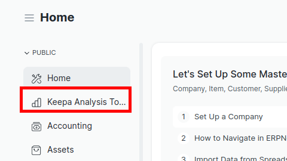

## Keepa Toolkit V2

  

Keepa Toolkit Frappe App

  

Це додаток для Frappe для порівняння наданих постачальниками товарних пропозицій з пропозиціями на платформі Amazon з використанням сервісу Keepa.

### Встановлення
Для початку викачайте та встановіть бібліотеку у систему frappe за допомогою команди

- <Code>bench get-app git@github.com:n-xy-krok/keepa_toolkit_v2.git </Code>

Далі виконайте встановлення додатку командою

 - <Code>bench install-app keepa_toolkit_v2 </Code>
	 > При цьому у базі данних створяться таблиці  upc_asin та product_compressed та створиться набір Doctype типу Number Card для робочого простору додатку

Далі виконайте міграцію і патч командою

  - <Code>bench  migrate</Code>
     > При цьому в файл common_site_config.json додасться запис про нового воркера і чергу, а також у файлі Procfile додасться створення нового воркера для додатку

Тепер можна запустити сервер, наприклад командою
 - <Code>bench start</Code>
 
### Приклади використання

При вході на Desk в меню зліва ви побачите новий пункт <b>Keepa Analysis Tools</b>

#### Налаштування Keepa

Перш за все потрібно заповнити поле API ключу від аккаунту Keepa. Ви можете знайти його за посиланням: 

https://keepa.com/#!api

#### Налаштування опрацювання категорій товарів

Перейдіть у вкладку Keepa Analysis Tools та оберіть <b>Category Retrieving Settings</b>

Тут знаходяться налаштування процессу паралельного отримання данних про топ 100_000 товарів для обраних категорій. Це тривалий і ресурсомісткий процесс, тому він виконується окремим, паралельним процессом.  
Налаштуйте час з якого скрипт може починати працювати, наповнюючи кеш, витрачаючи токени Keepa та час коли йому слід припинити роботу, для збереження токенів. (Наприклад у денний час, для роботи основного функціоналу) 
 
Потім беріть категорії які потрібно обробляти.

Не забудьте зберегти зміни

#### Аналіз прайсів.

Перейдіть у вкладку Keepa Analysis Tools та оберіть <b>+</b> біля списку аналізів.

Назвіть документ унікальним ім'ям, та прикріпіть файл прайсу в форматі .xlsx

Вкажіть назву сторіки документа.

Чекбокс вказує чи потрібно довантажувати позиції товарів(по upc) відсутні в кешах системи. 

    Зауважте, що зараз вимоги до прайсу є жорсткими і не можуть змінюватись. То ж наразі для прайсу вимагаються наступні колонки:
    UPC, Product Name, Product Description, Count in case for price, Restriction, MAP, Price per case, Product Discount

Після додавання файлу і заповнення інших полів Документ матиме наступний вигляд, просто натисніть кнопку <b>Start processing</b>

На екрані з'явиться повідомлення про початок роботи і в список додасться запис із статусом <b>In progress</b>

Для швидкого оновлення статусу можна використовувати кнопку <b>Refresh list</b>

Дочекайтесь доки статус зміниться на Success або Failure

Оновіть вікно результатів і побачите новий документ з відповідним ім'ям.

Клацніть на нього для переходу всередину документу і побачите результуючу таблицю.
Ви можете змінити колонки які виводяться на екран натиснувши на <b>знак шестерні</b> в правому верхньому куті таблиці.

Також справа, вище таблиці розташовані випадаючі списки дій для експорту таблиці і для створення ордеру.

Оберіть кілька, або усі товари та оберіть з табів потрібну дію.

Ось приклад створення нового ордеру

#### Імпорт експортованих з кіпи данних.

Для початку потрібно знайти список asin або upc потрібних товарів, скопіювати їх і запитати данні в веб інтерфейсі сервісу Keepa.

    Наразі список колонок жорсто закріплений. Файл має містити наступні колонки:
    ASIN    Product Codes: UPC    Product Codes: EAN    Title    URL: Amazon    Categories: Root    Buy Box: 90 days avg.    New, 3rd Party FBA: 90 days avg.    New, 3rd Party FBM: 90 days avg.    FBA Fees:    Package: Height (cm)    Package: Width (cm)    Package: Length (cm)    Package: Weight (g)    Count of retrieved live offers: New, FBA    New Offer Count: Current    Brand    Sales Rank: 90 days avg.    Reviews: Rating    Reviews: Review Count    Reviews: Review Count - 90 days avg.    Reviews: Review Count - 30 days avg.    Reviews: Review Count - 180 days avg.    Amazon: Availability of the Amazon offer    Amazon out of stock percentage: 90 days OOS %    Variation ASINs    Image    Locale
    
    Які можна налаштувати при запиті експорту

Далі створюємо новий документ імпорт, прикріплюємо до нього файл експортований з Keepa і запускаємо кнопкою <b>Absorb file</b>.

####

#### License

  

MIT
